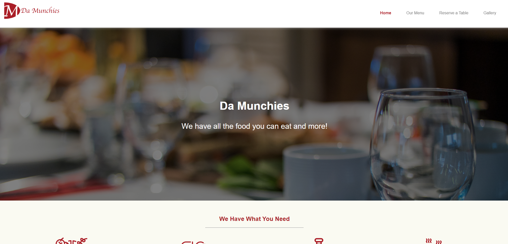
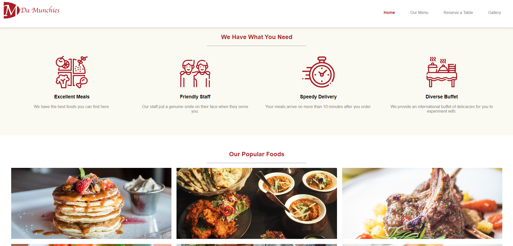
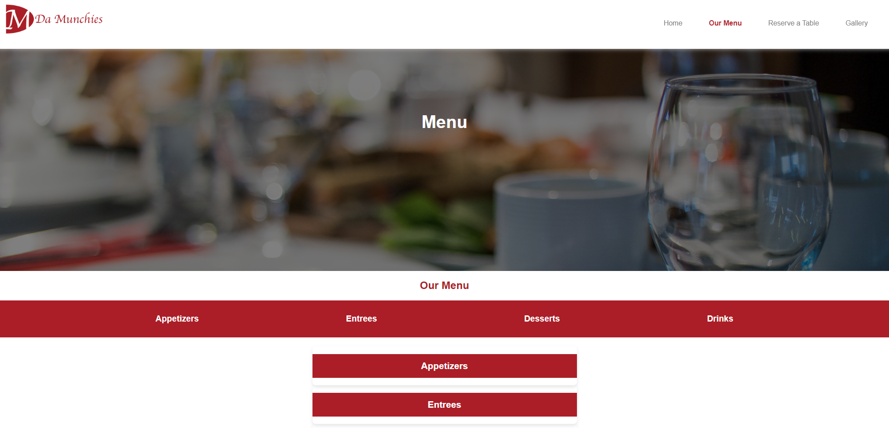
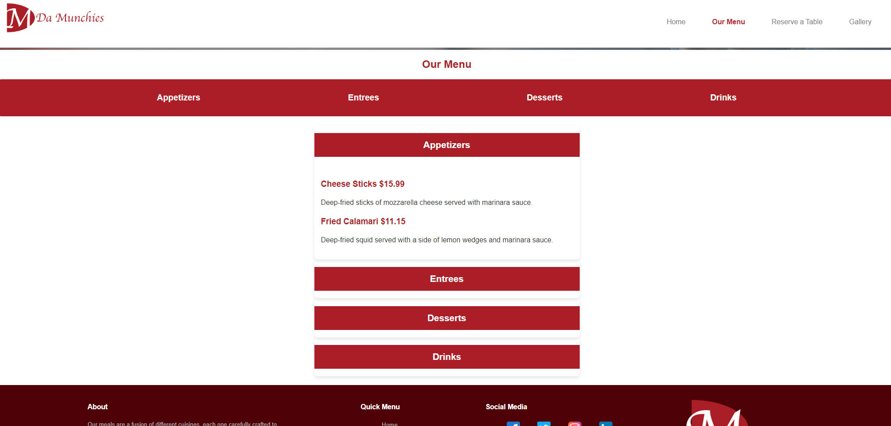
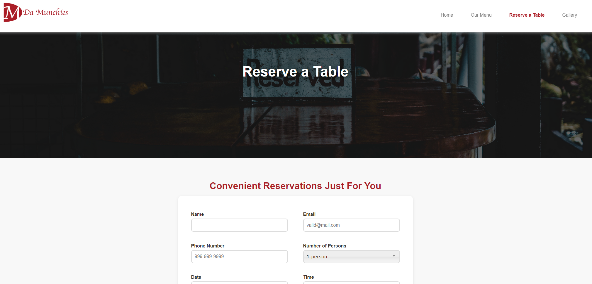
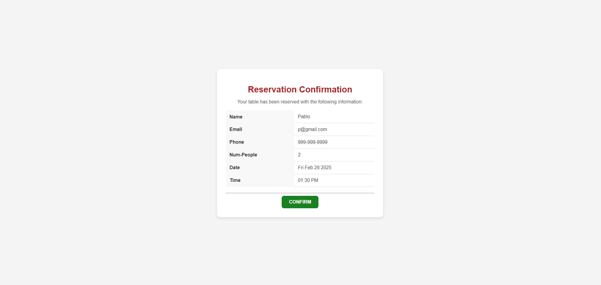
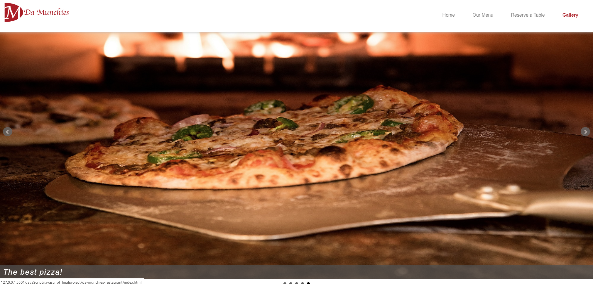
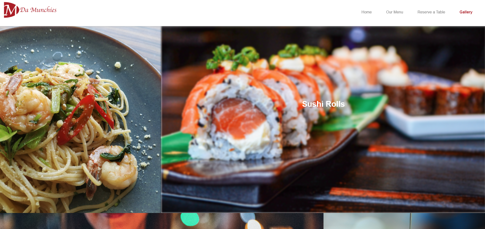
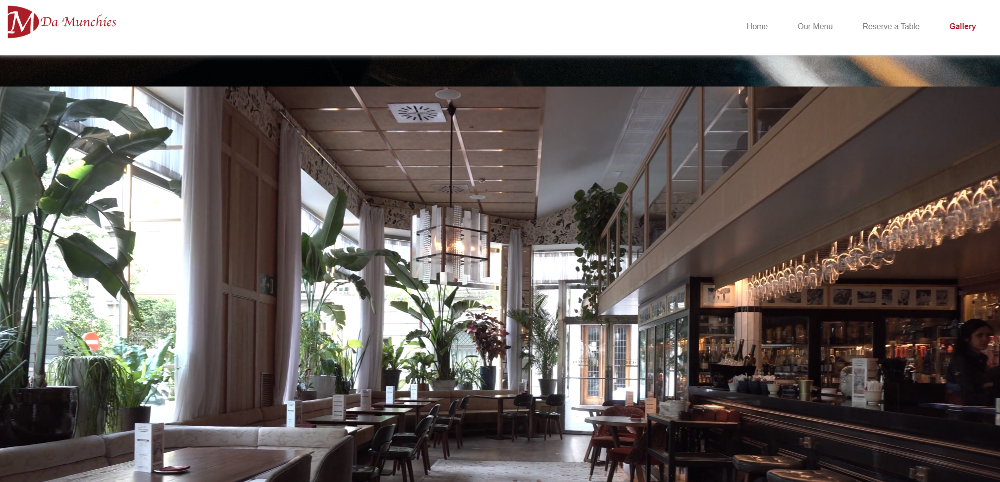

# 🍽️ Da Munchies - Restaurant Website

## 📌 Project Overview

**Da Munchies** is a restaurant website that provides an interactive user experience for browsing the menu, making reservations, and exploring the restaurant’s atmosphere through a gallery. The project features an elegant design, smooth animations, and a responsive layout.

This project was developed as a **final college group assignment**, and my primary contribution was the **Gallery Section**, which includes an interactive **image slider** and a **collage layout**.

---

## 🌍 Live Demo

🍽️ **Try it out here**: [Da Munchies Live Demo](https://da-munchies-restaurant.vercel.app)

---

## 🚀 Features

- 🍕 **Menu Page**: Browse various food categories with an **expandable accordion** design.
- 📸 **Gallery Page**: Displays restaurant images with an **interactive slider** and a **custom collage layout**.
- 🗓 **Reservation System**: Allows users to book a table with **form validation**.
- 🎨 **Responsive UI**: Ensures smooth usability across different devices.
- 🎭 **jQuery Animations**: Used for smooth **page transitions** and interactive elements.

---

## 🛠️ Technologies Used

- **HTML5** - Structure of the website.  
- **CSS3** - Styling and responsive layouts.  
- **JavaScript (ES6+)** - Interactive features.  
- **jQuery & jQuery UI** - Used for animations and dynamic elements.  
- **bxSlider** - Image slider for the gallery.

---

## 📌 Project Purpose

This project demonstrates:

- **Frontend Development**: Implementation of interactive and dynamic UI components.
- **UI/UX Design**: Creating a visually appealing and intuitive website.
- **jQuery Animations**: Enhancing user experience with smooth transitions.
- **Gallery Implementation**: Developing an interactive image slider and collage layout.
- **Form Validation**: Ensuring correct input handling for reservations.
- **Responsive Web Design**: Optimized display across different screen sizes.

---

## 📂 Project Structure

```
da_munchies_project/
├── 📝 css/                # Stylesheets
│   ├── index.css         # Main styling
│   ├── menu.css          # Menu page styles
│   ├── gallery.css       # Gallery section styles (My contribution)
│   ├── reserve.css       # Reservation page styles
│   ├── reserve-confirm.css # Reservation confirmation page styles
│   ├── jquery.bxslider.css # Slider library styles
├── 📝 js/                 # JavaScript files
│   ├── index.js          # Homepage interactions
│   ├── menu.js           # Menu accordion functionality
│   ├── gallery.js        # Gallery interactions (My contribution)
│   ├── reserve.js        # Reservation form validation
│   ├── jquery.bxslider.min.js # Image slider library
├── 📝 webpages/           # HTML pages
│   ├── menu.html         # Menu page
│   ├── gallery.html      # Gallery page (My contribution)
│   ├── reserve.html      # Reservation page
│   ├── reserve-confirm.html # Reservation confirmation
├── 📝 images/             # Image assets
├── 📝 video/              # Video assets
├── index.html              # Homepage
├── 📝 favicon.ico         # Website icon
```

---

## 🏃‍♂️ How to Run the Project

1. Open `index.html` in a web browser.  
2. Navigate through the pages using the top menu.

---

## 🌟 My Contribution

For this project, I was responsible for developing:

- 📸 **Gallery Page (gallery.html)** - Designed the layout and content.
- 📷 **Image Slider (gallery.js)** - Integrated bxSlider for smooth image transitions.
- 🎨 **Collage Section (gallery.css)** - Styled the custom image and video collage.
- 💡 Ensured seamless responsiveness and animations.

---

## 🖼️ Screenshots

| Home 1 | Home 2 |
|-----------|-----------|
|  |  |

| Menu 1 | Menu 2 |
|-----------|-----------|
|  |  |

| Reserve 1 | Reserve 2 |
|-----------|-----------|
|  |  |

| Gallery 1 | Gallery 2 | Gallery 3 |
|-----------|-----------|-----------|
|  |  |  |

---

## 📝 License

This project was developed for **educational purposes** as part of a **college final assignment**.

---

## 💼 Author
👤 **Juan Jacobo Florez Monroy**  
🌐 **Portfolio**: [jjacobo95.com](https://jjacobo95.com)  
🐙 **GitHub**: [github.com/jjacoboflorez95](https://github.com/jjacoboflorez95)